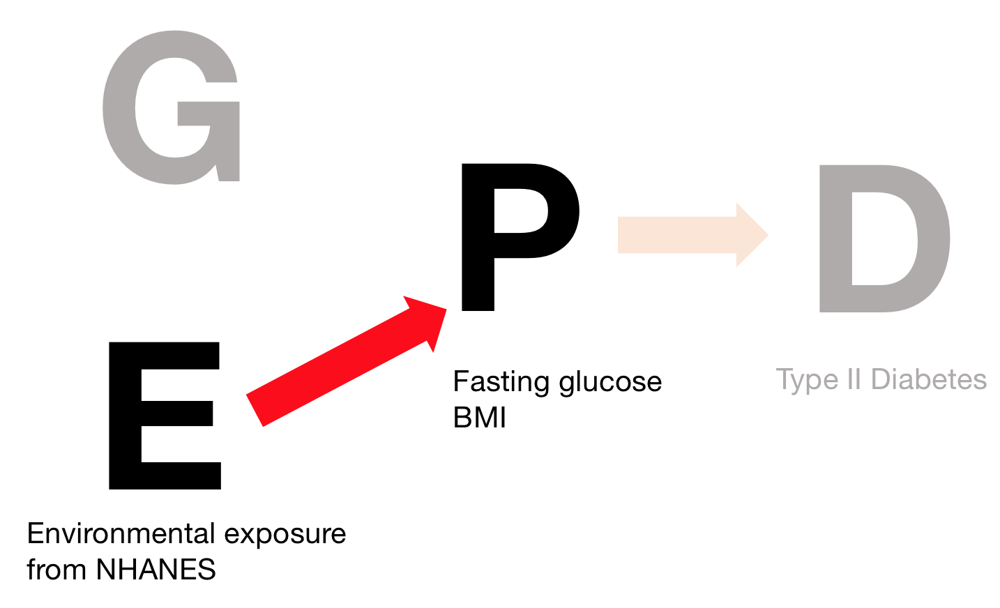

```{r message=FALSE}
load("assignment3.rdata")
library(survey)
library(dplyr)
library(ggplot2)
library(stringr)
library(broom)

```

# Background Questions:

### 1.) How are the phenotypes (glucose and BMI) assessed in the NHANES? (1 point)

__ANS:__  
_LBXGLU: Fasting Glucose (mg/dL):_  
Participants aged 12 years and older who were examined in the morning session were tested. Glucose concentration was determined by a hexokinase method. It is an endpoint enzymatic method with a sample blank correction.  

Blood specimens were processed, stored and shipped to Fairview Medical Center Laboratory at the University of Minnesota, Minneapolis Minnesota for analysis. Detailed specimen collection and processing instructions are discussed in the NHANES LPM.  

_BMXBMI: Body Mass Index (kg/m**2)_  

BMI values are calculated for National Health and Nutrition Examination Survey (NHANES) participants using measured height and weight values as follows: weight (kilograms)/height squared (meters)

All survey participants were eligible for the body measurement component. The body measurement data were collected by trained health technicians. The health technician was accompanied by a recorder during each body measurement examination. The respondent’s age, at the time of the screening interview, determined the body measurement examination protocol for survey participants


### 2.) What does representative mean with respect to NHANES? Why is it a different than say, the
Framingham Heart Study or the Nurses Health Study? (1 point)

__ANS:__  
The NHANES sample for the survey is selected to represent the U.S. population of all ages. To produce reliable statistics, NHANES over-samples persons 60 and older, African Americans, and Hispanics.

While other studies, like Framingham Heart Study or Nurses Health Study are representative of a particular subgroup of population.


### 3.) These phenotypes (glucose and BMI) are related to type 2 diabetes. Draw the E, G, P, and D diagram
and annotate what you are investigating in your anticipated NHANES EWASs (2 points).




### 4.) How are the environmental exposures measured in the NHANES? Choose a few examples (up to 5) of
different types of biomarkers of environmental exposures from the ExposureList array and query the
NHANES website for the assay description of the biomarker (5 points).

1. Cadmium, Lead, & Total Mercury - Blood Component

_Environmental exposures:_  
- LBXBCD - Cadmium (ug/L)

_Description:_
A cadmium assay is performed to identify cases of cadmium toxicity. Occupational exposure is the most common cause of elevated cadmium levels. 

- LBXBPB - Lead (ug/dL)
_Description:_
Lead is a known environmental toxin that has been shown to deleteriously affect the nervous, hematopoietic, endocrine, renal, and reproductive systems. In young children, lead exposure is a particular hazard because children more readily absorb lead than do adults, and children’s developing nervous systems also make them more susceptible to the effects of lead. The primary sources of exposure for children are lead-laden paint chips and dust as a result of deteriorating lead-based paint. The risk for lead exposure is disproportionately higher for children who are poor, non-Hispanic black, living in large metropolitan areas, or living in older housing. Among adults, the most common high exposure sources are occupational. Blood lead levels measured in previous NHANES programs have been the cornerstone of lead exposure surveillance in the U.S. The data have been used to document the burden and dramatic decline of elevated blood lead levels, to promote the reduction of lead use, and to help to redefine national lead poisoning prevention guidelines, standards, and abatement activities.

_Target:_
Samples: Participants aged 1 year and older who do not meet any of the exclusion criteria are eligible. 

_Data Process:_
Whole blood specimens are processed, stored, and shipped to the Division of Laboratory Sciences, National Center for Environmental Health, and Centers for Disease Control and Prevention for analysis. 

2. Metals - Urine (UHM_D) Components

_Environmental Exposures:_
- URXUCO - Cobalt, urine (ug/L)
- URXUCS - Cesium, urine (ug/L)
_Description:_
Trace metals have been associated with adverse health effects in occupational studies or laboratory studies, but have not been monitored in general population groups.

This method is used to achieve rapid and accurate quantifications of multiple elements of toxicological and nutritional interest. The method is sensitive and rapid enough to screen urine specimens from subjects suspected to be exposed to a number of important toxic elements or to evaluate environmental or other nonoccupational exposure to these same elements.

_Target Samples:  _
Participants aged 6 years and older who met the subsample requirements.  
_Data Process:_  
Urine specimens are processed, stored, and shipped to the Division of Environmental Health Laboratory Sciences, National Center for Environmental Health, Centers for Disease Control and Prevention for analysis

3. Cotinine - Serum (COT_D) Component  

_Environmental Exposures:_
LBXCOT - Cotinine (ng/mL)

_Description:_  
The specific aims of the component are:

- to measure the prevalence and extent of tobacco use;
- to estimate the extent of exposure to environmental tobacco smoke (ETS), and determine trends in exposure to ETS; 
- to describe the relationship between tobacco use (as well as exposure to ETS) and chronic health conditions, including respiratory and cardiovascular diseases.

The tobacco component for NHANES will include questionnaire items on current and past use of cigarettes, pipes, cigars and smokeless tobacco. Exposure to ETS at home and at work and in-utero ETS exposure among children will also be obtained. ETS exposure will also be assessed for examinees 3 years of age and older through the measurement of serum cotinine, a metabolite of nicotine. In addition, use of nicotine replacement products (e.g., gum and patch) will be collected using questionnaires.

_Target Samples:  _
Participants aged 3 years and older who do not meet any of the exclusion criteria are eligible.

_Data Process:_  
Serum specimens are processed, stored, and shipped to the Division of Environmental Health Laboratory Sciences, National Center for Environmental Health, Centers for Disease Control and Prevention for analysis


### 5.) Let’s explore the phenotypes, body mass index (BMXBMI) and fasting glucose (LBXGLU) with respect to
demographic characteristics of your population in the training dataset. (36 points total from a.)-i.); 37
points total)

#### a.) How many individuals are there with BMI values? Draw a histogram of BMI and describe the
mean and median. Is the distribution skewed? (1 point)
```{r}
BMI <- NHData.train  %>% filter(!is.na(BMXBMI)) 

BMI <- BMI %>% mutate(sex = case_when( male == 1 ~ "male", 
                                         female == 1 ~ "female"),
                        race = case_when(white == 1 ~ "white",
                                         black == 1 ~ "black",
                                         mexican == 1 ~ "mexican",
                                         other_hispanic == 1 ~ "hispanic",
                                         other_eth == 1 ~ "others"))
BMI$race <- factor(BMI$race, levels = c("white","black","mexican","hispanic","others"))

dsn <- svydesign(ids=~SDMVPSU, strata=~SDMVSTRA, weights=~WTMEC2YR, nest=T, data=BMI)

```

```{r}
svyhist(~ BMXBMI, dsn)
svymean(~ BMXBMI, dsn)
svyquantile( ~ BMXBMI, dsn, quantiles = 0.5)
dim(BMI)
```

__ANS:__ 17472, mean: 25.839 Median: 25.19 The distribution is right skewed

#### b.) Plot BMI vs age. (1 point)

```{r}
svyplot( BMXBMI ~ RIDAGEYR, design = dsn)
```

#### c.) Plot a boxplot of BMI versus sex. (1 point)
```{r}
svyboxplot( BMXBMI ~ sex, design = dsn)
```

#### d.) Plot a boxplot of BMI versus race/ethnicity. (1 point)
```{r}
svyboxplot(BMXBMI ~ white + black + mexican + other_hispanic + other_eth, dsn, 
           names=c("White","Black","Mexican", "Other Hispanic", "Others"), 
           xlab = "Race/Ethnicity",
           ylab = "BMI")
```

#### e.) Plot BMI versus an indicator of socioecononomic status, the income to poverty ratio
(INDFMPIR). The income-to-poverty ratio is a the household income divided by the household
poverty level for a given survey year. Therefore a Income-to-poverty ratio of 1 means the
individual has household income equal to the poverty level.
```{r}
svyplot(BMXBMI ~ INDFMPIR, dsn , xlab = "Income-to-poverty ratio", ylab = "BMI")
```

#### f.) Describe your findings from the plots a-e qualitatively. (1 point)

__ANS:__
1. BMI seems to slightly increase with age in the beginning, and achieve it's peak between 40 to 50, then the decrease with age.   
2. BMI seems no significantly different between sex, and race.   
3. BMI slightly increased with income-to-poverty ratio, but may not be significant.


#### g.) What statistical linear model would you use to test the significance and effect of your findings
in (f)? (2 points)

__ANS:__
Linear regression. The coefficient of the variables will tell the effects, and the p-value will tell the significance.

#### h.) Using the model you described in (g), estimate the following:
##### i.) Change in BMI for a 1 year change in age and significance of this association. (3 points)
```{r}
fit <- svyglm(BMXBMI ~ RIDAGEYR, data = BMI, design = dsn)
fit %>% tidy()
```
__ANS:__
A 1 year change in age increase the BMI by 0.145, p-value is $6.4 * 10^{-27}$, which is significant.

##### ii.) Average BMI in males versus females and significance. (3 points)
```{r}
fit <- svyglm(BMXBMI ~ sex, data = BMI, design = dsn)
fit %>% tidy()
```
__ANS:__
Average BMI in female is 26.06 and in male is 25.60. p-value is $2.45 * 10^{-3}$, which is significant


##### iii.) Average BMI in Non-Hispanic Black versus Whites, Mexican American versus Whites, and Other Hispanic vs. White, and Other versus White (4 points).
```{r}
fit <- svyglm(BMXBMI ~ race, data = BMI, design = dsn)
fit %>% tidy()
```
__ANS:__ 
Average BMI and significance:  
White: 25.876 (reference)
Black: 26.509, p-value = 0.0098 , BMI is significantly different between black and white  
Mexian:25.199, p-value = 0.0031 , BMI is significantly different between mexican adnd white  
Other Hispanic: 25.85, p-value = 0.939, BMI is not significantly different between other hispanic and white
Others: 24.793, p-value = 0.0493, BMI is borderline significantly different between others and white

#### i.) Repeat 5 (a-h) with fasting glucose (LBXGLU) (18 points).
```{r}
GLU <- NHData.train  %>% filter(!is.na(LBXGLU)) 

GLU <- GLU %>% mutate(sex = case_when( male == 1 ~ "male", 
                                         female == 1 ~ "female"),
                        race = case_when(white == 1 ~ "white",
                                         black == 1 ~ "black",
                                         mexican == 1 ~ "mexican",
                                         other_hispanic == 1 ~ "hispanic",
                                         other_eth == 1 ~ "others"))
GLU$race <- factor(GLU$race, levels = c("white","black","mexican","hispanic","others"))

dsn <- svydesign(ids=~SDMVPSU, strata=~SDMVSTRA, weights=~WTMEC2YR, nest=T, data=GLU)
```

i.a) 
```{r}
svyhist(~ LBXGLU, dsn)
svymean(~ LBXGLU, dsn)
svyquantile( ~ LBXGLU, dsn, quantiles = 0.5)
dim(GLU)
```
__ANS:__ There are 6476 individuals without NA, mean: 100,23 Median: 94.6 The distribution is more right skewed than BMI.

i.b)
```{r}
svyplot( LBXGLU ~ RIDAGEYR, design = dsn)
```

i.c)
```{r}
svyboxplot(LBXGLU ~ sex, design = dsn)
```
i.d)
```{r}
svyboxplot(LBXGLU ~ white + black + mexican + other_hispanic + other_eth, dsn, 
           names=c("White","Black","Mexican", "Other Hispanic", "Others"), 
           xlab = "Race/Ethnicity",
           ylab = "Glucose")
```
i.e)
```{r}
svyplot(LBXGLU ~ INDFMPIR, dsn , xlab = "Income-to-poverty ratio", ylab = "Glucose")
```
i.f)
__ANS:__
1. Glucose do not have apparent linear relationship with age, but as age increases, the variation of glucose levels also increase
2. Through the boxplot it is hard to tell the different between sex, and race of glucose level.   
3. No significant linear relationship is observed between glucose and income-to-poverty ratio

i.g)
__ANS:__  
The same as bmi, we will use linear regression. The coefficient of the variables will tell the effects, and the p-value will tell the significance.

i.h.i)
__ANS:__
```{r}
fit <- svyglm(LBXGLU ~ RIDAGEYR , design = dsn)
fit %>% tidy()
```
__ANS:__
A 1 year change in age increase the glucose by 0.390, p-value is $2.167 * 10^{-14}$, which is significant.

i.h.ii)
```{r}
fit <- svyglm(LBXGLU ~ sex , design = dsn)
fit %>% tidy()
```
__ANS:__
Average glucose in female is 97.866 and in male is 102,699. p-value is $1.56 * 10^{-6}$, which is significant


i.h.iii.)
```{r}
fit <- svyglm(LBXGLU ~ race , design = dsn)
fit %>% tidy()
```

__ANS:__  
Average Glucose and significance:  
White: 100.04 (reference)
Black: 98.60, p-value = 0.276 , BMI is not significantly different between black and white  
Mexian:100.68, p-value = 0.548 , BMI is not significantly different between mexican adnd white  
Other Hispanic: 104.34, p-value = 0.166, BMI is not significantly different between other hispanic and white
Others: 100.254, p-value = 0.0493, BMI is not significantly different between others and white

The glucose is not statiscally different between different races

#### j.) How do the demographic characteristics qualitatively compare with those with Body Mass
Index? (e.g., what demographic characteristics are associated with both BMI and glucose?) (1
point)
__ANS:__  
1. Both BMI and glucose increase with age and are both significant.
2. BMI in female is larger than in male, while the glucose is the opposite - glucose in male is higher than in female. Both of them are significantly different.
3. Black and Mexican have significantly higher BMI than White, but the glucose have no significant difference between all groups.


### 6.) In the previous assignment, you got your hands dirty with binary data of genotypes from a GWAS array. In this question, we will explore how biomarkers of exposures are different that ‘cleaner’ measures of genetic variants.

Specifically, we will explore two biomarkers of exposure and nutrition, including a heavy metal exposure
that recently made the headlines in Flint, Michigan: serum Lead (LBXBPB). (13 points total)
```{r LBXBPB data processing}
BPB <- NHData.train %>% filter(!is.na(LBXBPB))

BPB <- BPB %>% mutate(sex = case_when( male == 1 ~ "male", 
                                         female == 1 ~ "female"),
                        race = case_when(white == 1 ~ "white",
                                         black == 1 ~ "black",
                                         mexican == 1 ~ "mexican",
                                         other_hispanic == 1 ~ "hispanic",
                                         other_eth == 1 ~ "others"))
BPB$race <- factor(BPB$race, levels = c("white","black","mexican","hispanic","others"))

dsn <- svydesign(ids=~SDMVPSU, strata=~SDMVSTRA, weights=~WTMEC2YR, nest=T, data=BPB)
  
```

#### a.) Plot a histogram of serum lead (LBXBPB) and qualitatively describe the shape of the
distribution. (1 point)
```{r}
svyhist(~ LBXBPB, dsn)
svymean(~ LBXBPB, dsn)
svyquantile( ~ LBXBPB, dsn, quantiles = 0.5)
dim(BPB)
```

__ANS:__
The distribution is highly right skewed, mean serum lead is 1.97, and the median is 1.5


#### b.) Investigators attempt to make this distribution more “normal” by applying a transformation --
what transformation would you use here (hint: think exponential decay)? Why would you want
to make a dependent variable look more “normal” (hint: think interpretation) (2 points)

__ANS:__
Take log transformation can make the data distribution less skewed. Making the data looks more normal with log transform let us able to fit our data into some general linear model, like t-test or regression.


#### c.) Plot LBXBPB vs age (1 point)
```{r}
svyplot(log(LBXBPB) ~ RIDAGEYR, dsn, xlab = "Age", ylab = "Lead")
```


#### d.) Plot a boxplot of LBXBPB versus sex (1 point)
```{r}
svyboxplot(log(LBXBPB) ~ sex, dsn, xlab = "Gender", ylab = "Lead")
```
#### e.) Plot a boxplot of LBXBPB versus race/ethnicity (1 point)
```{r}
svyboxplot(log(LBXBPB) ~ race, dsn, xlab = "Race", ylab = "Lead")
```
#### f.) Plot a plot of LBXBPB versus an indicator of socioecononomic status, the income to poverty
ratio (INDFMPIR) (1 point)
```{r}
svyplot(log(LBXBPB) ~ INDFMPIR, dsn, xlab = "Income-to-Poverty Ratio", ylab = "Lead")

```

#### g.) Using a linear regression model, estimate the following:

##### i.) Change in LBXBPB for a 1 year change in age and significance of this association (2
points).
```{r}
fit <- svyglm(log(LBXBPB) ~ RIDAGEYR, data = BPB, design = dsn)
fit %>% tidy()
```
__ANS:__ 
A 1 year change in age will increase log(LBXBPB) by 0.0093, which is about 1.01 in lead levels. P-value is $1.65*10^{-15}$, which is significant.

##### ii.) Average LBXBPB in males versus females and significance (2 points).
```{r}
fit <- svyglm(log(LBXBPB) ~ sex, data = BPB, design = dsn)
fit %>% tidy()
```
__ANS:__ Average Lead in female is $e^{0.243} = 1.275$, in male is $e^{0.637} = 1.891$, p-value is $1.37 * 10^{-23}$, which is significantly different


##### iii.) Average LBXBPB in Non-Hispanic Black) versus Whites, Mexican American versus
Whites, and Other Hispanic vs. White, and Other versus White (2 points).
```{r}
fit <- svyglm(log(LBXBPB) ~ race, data = BPB, design = dsn)
fit %>% tidy()
fit %>% tidy() %>% select(estimate) %>% exp()
```
__ANS:__
Average Lead levels and significance:  
White: 1.518 (reference)
Black: 1.159, p-value = $1.09 * 10^{-7}$ , Lead levels is significantly different between black and white  
Mexian:1.067, p-value = 0.065 , Lead levels is not significantly different between mexican adnd white  
Other Hispanic: 0.984, p-value = 0.720, Lead levels is not significantly different between other hispanic and white
Others: 0.936, p-value = 0.0294, Lead levels is significantly different between others and white


### 7.) How are nutrient factors distributed? Repeat question 5 a, c, d, e with serum vitamin D (LBXVID) (4
points)

7.a)
```{r}
VitD <- NHData.train  %>% filter(!is.na(LBXVID)) 

VitD <- VitD %>% mutate(sex = case_when( male == 1 ~ "male", 
                                         female == 1 ~ "female"),
                        race = case_when(white == 1 ~ "white",
                                         black == 1 ~ "black",
                                         mexican == 1 ~ "mexican",
                                         other_hispanic == 1 ~ "hispanic",
                                         other_eth == 1 ~ "others"))
VitD$race <- factor(VitD$race, levels = c("white","black","mexican","hispanic","others"))

dsn <- svydesign(ids=~SDMVPSU, strata=~SDMVSTRA, weights=~WTMEC2YR, nest=T, data=VitD)

```

```{r}
svyhist(~ LBXVID, dsn)
svymean(~ LBXVID, dsn)
svyquantile( ~ LBXVID, dsn, quantiles = 0.5)
dim(VitD)
```

__ANS:__ There are 7807 individuals with Vitamin D. Mean:23.76, Media:23, The distribution is normally distributed, with mildly right skewed


7.c)
```{r}
svyboxplot(LBXVID ~ sex, dsn, xlab = "sex", ylab = "Vitamin D")
```
7.d)
```{r}
svyboxplot(LBXVID ~ race, dsn, xlab = "race", ylab = "Vitamin D")
```
7.e)
```{r}
svyplot(LBXVID ~ INDFMPIR, dsn , xlab = "Income-to-poverty ratio", ylab = "BMI")
```

### 8.) Could demographic variables be confounders in a test of association between Lead and BMI or glucose? Mediators? Please justify. What about vitamin D? (4 points)

__ANS:__

Demographic variables can be confounders between Lead and BMI. For example, sex is associate with Lead level and BMI, therefore, sex can be a counfounder. Mediators has to be on the causative pathway between exposure(Lead) and outcome(BMI), demographic variables are less likely to be influence by lead level.

Vitamin D shows assoication with age, sex and race, so demorgraphic variables can also be counders between VitD and BMI. Demographic variables, again, is unlikely to a mediator. However, if we look at the association between lead and BMI, vitamin D could potentially be a mediator, if there are some biological evidence being proven. For example, lead level could influence the absorbtion of vitamin D, and cause the BMI change.

# Executing environment-wide associations (33 points):

### 1.) 
Now we will test each of the exposures in ExposureList for linear association with a quantitative or continuous trait in the training and testing datasets separately. Write R code, from scratch, to execute a EWAS called ewas.R for a given dataset (e.g., training or testing) (code and output: 10 total points).
Your script will input either a flag to execute the EWAS on the training or testing datasets and output a .csv file that contains the exposure ID (e.g., LBXBPB),exposure name, phenotype name,estimate,standard error, pvalue,false discovery rate (FDR)

As implied in the output above, your code should execute association that tests the association between each exposure in ExposureList and 1 SD of the phenotype (e.g., BMI) for a 1 standard deviation change in the logarithm base 10 of the exposure value. The dependent variable is the phenotype, and the independent variable is an exposure. Adjust all models by age, race/ethnicity, income/poverty ratio (INDFMPIR).
Using your R code, execute the following:

#### A.) EWAS on 1 standard deviation change of Body Mass Index (BMXBMI) in the training and testing datasets separately. To scale BMXBMI, you can use the scale command in the linear modeling function. Your output should be named bmi_train.csv and bmi_test.csv.

```{r}
flag <- "test"
if(flag == "train"){
  data <- NHData.train
}else{
  data <- NHData.test
}

data <- data  %>% filter(!is.na(BMXBMI)) 

data <- data %>% mutate(sex = case_when( male == 1 ~ "male", 
                                         female == 1 ~ "female"),
                        race = case_when(white == 1 ~ "white",
                                         black == 1 ~ "black",
                                         mexican == 1 ~ "mexican",
                                         other_hispanic == 1 ~ "hispanic",
                                         other_eth == 1 ~ "others"))

dsn <- svydesign(ids=~SDMVPSU, strata=~SDMVSTRA, weights=~WTMEC2YR, nest=T, data= data)
bmi <- data.frame(matrix(vector(), 0, 6))

for(exposure in ExposureList){
  f <- str_glue("scale(BMXBMI) ~ scale(log10({exposure} + 1e-07)) + RIDAGEYR + sex + race + INDFMPIR")
  exp_name <- ExposureDescription %>% filter(var == exposure) %>% select(var_desc) %>% distinct(var_desc) %>% slice(1) %>% pull(var_desc)
  # Check there is match for two data
  if(length(table(data$sex[!is.na(data[,exposure])]))<=1 | length(table(data[,exposure])) <= 1){
    d <- data.frame(exposure, exp_name, "BMXBMI", fit.estimate=NA,  fit.std.error=NA, fit.p.value=NA)
  }else{
    fit <- svyglm(f, data = data, dsn) %>% tidy() 
    target <- str_glue('scale(log10({exposure} + 1e-07))')
    if(target %in% fit$term){
      fit <- fit %>% filter(term == target)
      d <- data.frame(exposure, exp_name, "BMXBMI", fit$estimate, fit$std.error, fit$p.value)
    }else{
      d <- data.frame(exposure, exp_name, "BMXBMI", fit.estimate=NA,  fit.std.error=NA, fit.p.value=NA)
    }
  }
  bmi <- rbind(bmi, d)
}

colnames(bmi) <- c("Exposure ID", "Exposure Name", "Phenotype Name", "Estimate", "Standard Error", "P-value")

bmi$FDR <- p.adjust(bmi$`P-value`, method = "fdr")

output <- str_glue("bmi_{flag}.csv")
write.csv(bmi,output, row.names = FALSE)
```

#### B.) EWAS in 1 standard deviation of the logarithm base e of fasting blood glucose (LBXGLU) in
the training and testing datasets separately. To scale fasting glucose, you can use the scale and
log command in the linear modeling function. Your output should be named
fasting_glucose_train.csv and fasting_glucose_test.csv.

```{r}
flag <- "test"
if(flag == "train"){
  data <- NHData.train
}else{
  data <- NHData.test
}

data <- data  %>% filter(!is.na(LBXGLU)) 

data <- data %>% mutate(sex = case_when( male == 1 ~ "male", 
                                         female == 1 ~ "female"),
                        race = case_when(white == 1 ~ "white",
                                         black == 1 ~ "black",
                                         mexican == 1 ~ "mexican",
                                         other_hispanic == 1 ~ "hispanic",
                                         other_eth == 1 ~ "others"))

dsn <- svydesign(ids=~SDMVPSU, strata=~SDMVSTRA, weights=~WTMEC2YR, nest=T, data= data)
glu <- data.frame(matrix(vector(), 0, 6))

for(exposure in ExposureList){
  f <- str_glue("scale(log(LBXGLU)) ~ scale(log10({exposure} + 1e-07)) + RIDAGEYR + sex + race + INDFMPIR")
  exp_name <- ExposureDescription %>% filter(var == exposure) %>% select(var_desc) %>% distinct(var_desc) %>% slice(1) %>% pull(var_desc)
  # Check there is match for two data
  if(length(table(data$sex[!is.na(data[,exposure])]))<=1 | length(table(data[,exposure])) <= 1){
    d <- data.frame(exposure, exp_name, "LBXGLU", fit.estimate=NA,  fit.std.error=NA, fit.p.value=NA)
  }else{
    fit <- svyglm(f, data = data, dsn) %>% tidy() 
    target <- str_glue('scale(log10({exposure} + 1e-07))')
    if(target %in% fit$term){
      fit <- fit %>% filter(term == target)
      d <- data.frame(exposure, exp_name, "LBXGLU", fit$estimate, fit$std.error, fit$p.value)
    }else{
      d <- data.frame(exposure, exp_name, "LBXGLU", fit.estimate=NA,  fit.std.error=NA, fit.p.value=NA)
    }
  }
  glu <- rbind(glu, d)
}

colnames(glu) <- c("Exposure ID", "Exposure Name", "Phenotype Name", "Estimate", "Standard Error", "P-value")

glu$FDR <- p.adjust(glu$`P-value`, method = "fdr")

output <- str_glue("glu_{flag}.csv")
write.csv(glu,output, row.names = FALSE)
```

#### C.) Use the p.adjust function in R to estimate the Benjamini-Hochberg False Discovery Rate.
You can execute your ewas.R script on Orchestra OR on your local computer.


### 2.) Analysis of EWAS results:

#### a.) Produce a volcano plot of the results for glucose and body mass index by plotting the association size, or estimate on the x-axis and the -log10(p-value) on the yaxis. What is this plot depicting? Why is it useful to scale the dependent and independent variables before running the model? (1 point)

```{r}
bmi <- read.csv("bmi_train.csv")
bmi %>% filter(!is.na(Estimate)) %>% mutate(threshold = ifelse(Estimate >= 0.2 | Estimate <= -0.2, "Out", "In")) %>%  ggplot(aes(x=Estimate, y=-log10(FDR))) +
geom_point(aes(col = threshold), size=1.2) +
scale_colour_manual(values = c("Out" = "Red", "In" = "Black"))
```

```{r}
glu <- read.csv("glu_train.csv")
glu %>% filter(!is.na(Estimate)) %>% mutate(threshold = ifelse(Estimate >= 0.2 | Estimate <= -0.2, "Out", "In")) %>%  ggplot(aes(x=Estimate, y=-log10(FDR))) +
geom_point(aes(col = threshold), size=1.2) +
scale_colour_manual(values = c("Out" = "Red", "In" = "Black"))
```

__ANS:__ The vocalno plot shows the significance and effect size at the same time. The higher the point is means it's more significant, and the outer it is mean it has larger effect size. The reason we scale the variables is because now we can compare all the variables wit different absolute value on the same scale.


#### b.) What is the pvalue that achieves FDR of 5%? Of 1%? What does FDR at a certain threshold
mean? (2 points)
```{r}
files <- c("bmi_train.csv","bmi_test.csv","glu_train.csv","glu_test.csv")

for(file in files){
  data <- read.csv(file)
  order_data <- data[order(data$FDR),c("P.value","FDR")]
  print(order_data[max(which(order_data$FDR < 0.05)),])
  print(order_data[max(which(order_data$FDR < 0.01)),])
}

```

__ANS:__
BMI Train: FDR 5%: 0.0211   1%: 0.0028
BMI Test: FDR 5%: 0.0216  1%: 0.0031
Glucose Train: FDR 5%: 0.0040 1%: 0.00015
Glucose Test: FDR 5%: 0.0025  1%: 0.00045

FDR 5% threshold means that in multiple testing, we want to control the expected propotion of the expected proportion of "discoveries" (rejected null hypotheses) that are false (incorrect rejections) to be 5%, and 1% . Same for FDR 1%.

#### c.) Write code to filter out “replicated” findings using the following heuristic: FDR significance of 10% in the training dataset, p-value < 0.05 in the testing dataset, and concordant directionality of associations (e.g., both are >0 OR both are less than <0). How many findings were replicated in body mass index? And in fasting glucose? (5 points)
```{r bmi replicated}
bmi_train <- read.csv("bmi_train.csv")
bmi_test <- read.csv("bmi_test.csv")

bmi_train_list <- bmi_train %>% filter(FDR < 0.1) 
bmi_test_list <- bmi_test %>% filter(P.value < 0.05) 

bmi_list <- bmi_train_list %>% 
              inner_join(bmi_test_list, by = "Exposure.ID")  %>% 
              filter(Estimate.x * Estimate.x > 0)
dim(bmi_list)
```
```{r glucose replicated}
glu_train <- read.csv("glu_train.csv")
glu_test <- read.csv("glu_test.csv")

glu_train_list <- glu_train %>% filter(FDR < 0.1) 
glu_test_list <- glu_test %>% filter(P.value < 0.05)

glu_list <- glu_train_list %>% 
              inner_join(glu_test_list, by = "Exposure.ID")  %>% 
              filter(Estimate.x * Estimate.x > 0)

dim(glu_list)
```

__ANS:__
There are 63 replicated findings in BMI, and 9 replicated findings in glucose.

#### d.) Interpret analytically the top 3 most findings, ranked by low to high FDR in body mass index and fasting glucose. Specifically, how much does (a) body mass index and (b) fasting glucose change with respect to the top finding? Write down your answer in the units of estimate. (3 points)
```{r}
bmi_list %>% arrange(FDR.x) %>% head()

glu_list %>% arrange(FDR.x) %>% head()
```
BMI Top 3 findings:
1. LBXGTC	g-tocopherol(ug/dL) : BMI increase by 0.2276420 SD, with 1 SD change
2. LBXB12	Vitamin B12, serum (pg/mL): BMI decrease by  0.2042356, with 1 SD change
3. LBXFOL	Folate, serum (ng/mL): BMI decrease by 0.1892721, with 1 SD change

Glucose Top3 findings:
1. LBXGTC	g-tocopherol(ug/dL): Glucose increase by 0.15445792		SD, with 1 SD change
2. LBXBEC	trans-b-carotene(ug/dL): Glucose decrease by 0.10802779	 SD, with 1 SD change
3. LBXCBC	cis-b-carotene(ug/dL): Gluose decrease by 0.09134860 SD, with 1 SD change


#### e.) How similar (or dissimilar) are the estimates found in BMI and glucose respectively? Correlate
the estimates (from the training data) by plotting the estimates from body mass index on one
axis and glucose on the other (each point is an estimate for a biomarker of exposure). What
findings have replicated effects in the same direction? Different directions? What might this imply with respect to these phenotypes? (4 points)

```{r}
similarity <- data.frame(term = bmi_train$Exposure.ID, bmi_estimate = bmi_train$Estimate, glu_estimate = glu_train$Estimate) %>% 
  mutate(direction = case_when(bmi_estimate * glu_estimate > 0 ~ "Same Direction",bmi_estimate * glu_estimate <0 ~"Different Direction")) %>% filter(!is.na(direction)) %>%
  mutate(replicate = case_when(term %in% bmi_list$Exposure.ID | term %in% glu_list$Exposure.ID ~ "Replicate",
                               TRUE ~ "Not Replicate")) %>% 
  mutate(label = case_when(replicate == "Replicate" & direction == "Same Direction" ~ "Replicate-Same",
                           replicate == "Replicate" & direction == "Different Direction" ~ "Replicate-Different",
                           TRUE ~ "Non-Replicate"))
ggplot(similarity, aes(x = bmi_estimate, y = glu_estimate, col = label)) + geom_point()
similarity %>% filter(label == "Replicate-Same") %>% select(term) %>% print()
similarity %>% filter(label == "Replicate-Different") %>% select(term) %>% print()
```

__ANS:__ 
There are 39 findings that have replicated effects in either bmi or glucose and have same direction.
LBXBPB,LBXCOT,URXUBA,URXUSB,LBXFOL,LBXVID,URXMEP,URXMZP,URXMHH,URXMOH,LBX074,LBX105,LBX118,LBXD04,LBXD05,LBXD07,LBXF04,LBXF05,LBXPCB,LBX099,LBX194,LBX196,LBD199,LBXBHC,LBXPDT,LBXTNA,LBXHPE,LBXDIE,URXP04,URXP06,URXP07,URXP17,LBXIRN,LBXALC,LBXBEC,LBXCBC,LBXCRY,LBXGTC,LBXLUZ

There are 19 findings that have replicated effects and have different direction.
URXUCD,URXUCS,URXUTL,LBXB12,LBX156,LBXHXC,LBX146,LBX153,LBX170,LBX178,LBX180,LBX187,LBX206,LBXMIR,URXP02,URXP19,LBXLYC,LBXRPL,LBXRST,LBXVIA,URX14D,LBXSPH,URXETL

When we try to evaluate the association between glucose and bmi, these exposure could be potential confounders that influence the phenotypes.


### 3.) How correlated are the exposures that are replicated body mass index and glucose? Take the union of the variables that your replicated and estimate their correlation (using cor) and plot these using a heatmap (try heatmap.2 from the gplots package). How do the correlations compare qualitatively with correlations observed in genetics (Hint: think linkage disequilibrium). What is the implications of correlations such as these when interpreting potential findings? (5 points)

```{r}
library(gplots)
replicate_list <- union(bmi_list$Exposure.ID , glu_list$Exposure.ID)
replicate_exposure <- NHData.train %>% filter(!is.na(BMXBMI) & is.na(LBXGLU)) %>% select(replicate_list)  
replicate_correlation <- cor(as.matrix(replicate_exposure), use = 'pairwise.complete.obs')

heatmap.2(replicate_correlation,cexCol = 0.7, cexRow = 0.7)
```
__ANS:__
In GWAS, some SNPs are highly correlated due to linkage disequilibrium, and in EWAS, these correlated exposure could probably caused by the sampling of sources(ex: both collected from air pollution, or plastic products).


4.) Unlike in GWAS with static SNPs (variables that do not change as a function of time, behavior, or disease biology), environmental exposures are highly correlated with one another, they are dependent on time. Therefore, exposures could be subject to many biases. Propose factors that could induce selection bias, confounding bias, and reverse causality. (2 points)

__ANS:__  
_Selection bias:_
Selection bias can result when the selection of subjects into a study or their likelihood of being retained in the study leads to a result that is different from what you would have gotten if you had enrolled the entire target population. For example, using questionnaire can probably obtain only some subgroup samples with older age, and the age difference could also influence the outcome like BMI and glucose.

_Confounding bias:_
Other than sex, race, social-econmic factors, other demographic factors that is not controlled can also be confounders, like occupation. Workers in the factory could have higher opportunities exposing to heavy metals. Also, these workers could spend more time on laboring work instead of stay in the office, and have lower BMI. If the assumption hold, the occupation would be a coufounder between heavy metal exposure and BMI.

_reverse causality:_
People who have higher blood sugar may be more aware of their own diet and lifestyle, so they may be lower in saturated fat and cholesterol, higher in vitamin and other nutrients. In this case would be a reverse causality.


5.) In what other contexts and datasets could you use a method like ‘EWAS’ or ‘GWAS’? What are the advantages and disadvantages of the method? (3 points)
__ANS:__
When we try to explore the cause or association of particular outcomes, such as pheotypes or disease, we can make use of this techinique to perform multiple testing. Dataset with large number of variables, such as SNPs or environmental exposure are suitable for such analysis. Other dataset, such EMR- with large number of patient clincal phenotypes can be use to perform Phenome-wide association study to find the association of particular genetic mutation and clinical presentation.

The advantages of this method is that it can efficiently scan through large number of variables, and select the targets for further investigation. The disadvantage is that using multiple testing, it can easily create a lot of false positive results, and need to be adjust. 


# (Bonus) Executing environment-wide associations in all-cause mortality (20 points):
You just successfully executed cross-sectional associations in two continuous phenotypes, fasting glucose and body mass index.

### 1.) What does “cross-sectional” mean? How does this study design differ from other designs that take temporality into account? (4 points)

__ANS:__  A study with individual-level variables that measures exposure and disease at one point in time. A snapshot of the study population.  This study design provides weak evidence of causal assocation between exposure and outcome because we may not be certain that the exposure preceded the disease.


### 2.) You hypothesize that certain exposures may increase or decrease risk for mortality, the hardest disease endpoint of all. What modeling techniques can you use to estimate the risk for time to death? (2 points)

__ANS:__
Cox Regression Model.

3.) Two columns in the dataset include PERMTH_EXM and MORTSTAT. Specifically, the US CDC
ascertains if individuals surveyed in the NHANES have died in years 2006 and beyond. If they have died at the time of followup, the MORTSTAT variable is equal to 1. If they have not died, the MORTSTAT variable is equal to 0. The time at which death is ascertained from the time an individual surveyed is in the variable PERMTH_EXM. For example, if the PERMTH_EXM variable is equal to 10, and the MORTSTAT is equal to 1, that means the individual died 10 months after the survey when follow. If the MORTSTAT is equal to 1, the individual was alive at the time of follow-up. Use this information to estimate whether any of your top findings in fasting glucose and body mass index is associated with time to death, even after accounting for individual age, sex, race/ethnicity, and income to poverty ratio. Specifically, estimate the risk for death as a hazard ratio for the top finding from your
BMI and glucose EWAS. (14 points)

```{r}
library("survival")
library("survminer")


survive_data <- NHData.train %>% filter(!is.na(PERMTH_EXM) & !is.na(MORTSTAT)) %>%
  mutate(sex = case_when( male == 1 ~ "male", 
                          female == 1 ~ "female"),
          race = case_when(white == 1 ~ "white",
                           black == 1 ~ "black",
                           mexican == 1 ~ "mexican",
                           other_hispanic == 1 ~ "hispanic",
                           other_eth == 1 ~ "others"))
survive_data$race <- factor(survive_data$race, levels = c("white","black","mexican","hispanic","others"))

dsn <- svydesign(ids=~SDMVPSU, strata=~SDMVSTRA, weights=~WTMEC2YR, nest=T, data=survive_data)


for(top_exposure in c("LBXGTC","LBXB12","LBXFOL","LBXGTC","LBXBEC","LBXCBC")){
  f <- str_glue("Surv(PERMTH_EXM, MORTSTAT) ~ scale({top_exposure})+ RIDAGEYR + sex + race + INDFMPIR")
  res_cox <- svycoxph(as.formula(f) , data = survive_data, design = dsn)
  print(res_cox %>% tidy())
}
```

BMI Top 3 findings:
1. LBXGTC g-tocopherol(ug/dL) : Hazard ratio change by a factor of exp(0.1148822) = 1.121, with 1 SD change of LBXBHC, p-value = 0.0082, which mean LBXGTC significantly increase hazard ratio
2. LBXB12  Vitamin B12(pg/mL): Hazard ratio change by a factor of exp(0.02023399) = 1.021, with 1 SD change of LBX099, p-value = 0.37, which is not significant
3. LBXFOL Folate(ng/mL):  Hazard ratio change by a factor of exp(-0.0242372010) = 1.019, with 1 SD change of LBX074, p-value = 0.65, which is not significant

Glucose Top3 findings:
1. LBXGTC g-tocopherol(ug/dL) : Hazard ratio change by a factor of exp(0.1148822) = 1.121, with 1 SD change of LBXBHC, p-value = 0.0082, which mean LBXGTC significantly increase hazard ratio
2. LBXBEC trans-Beta carotene (ug/dL): Hazard ratio change by a factor of exp(-0.24102727) = 0.786, with 1 SD change of LBXPFDO, p-value = $5.4*10^{-5}$, meaning LBXBEC significantly reduce the hazard ratio.
3. LBXCBC cis-Beta carotene (ug/dL):Hazard ratio change by exp(-0.15525258) = 0.856, with 1 SD change of LBX074, p-value = 0.0071, meaning LBXCBC significantly reduce the hazard ratio
