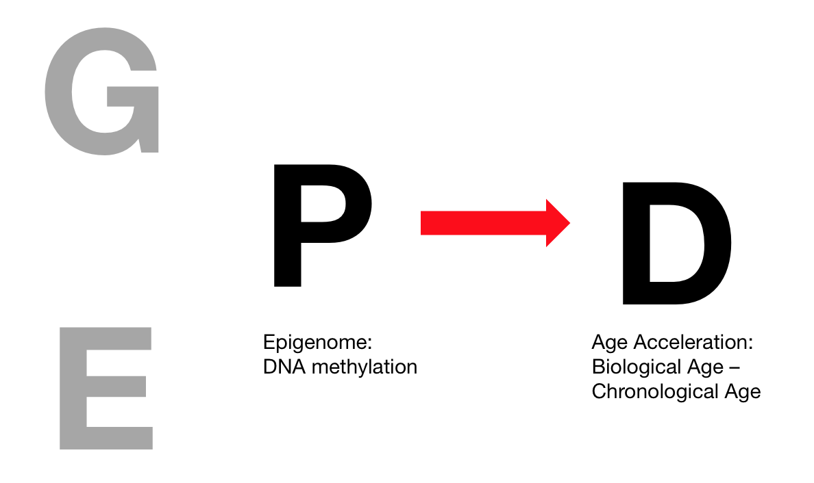
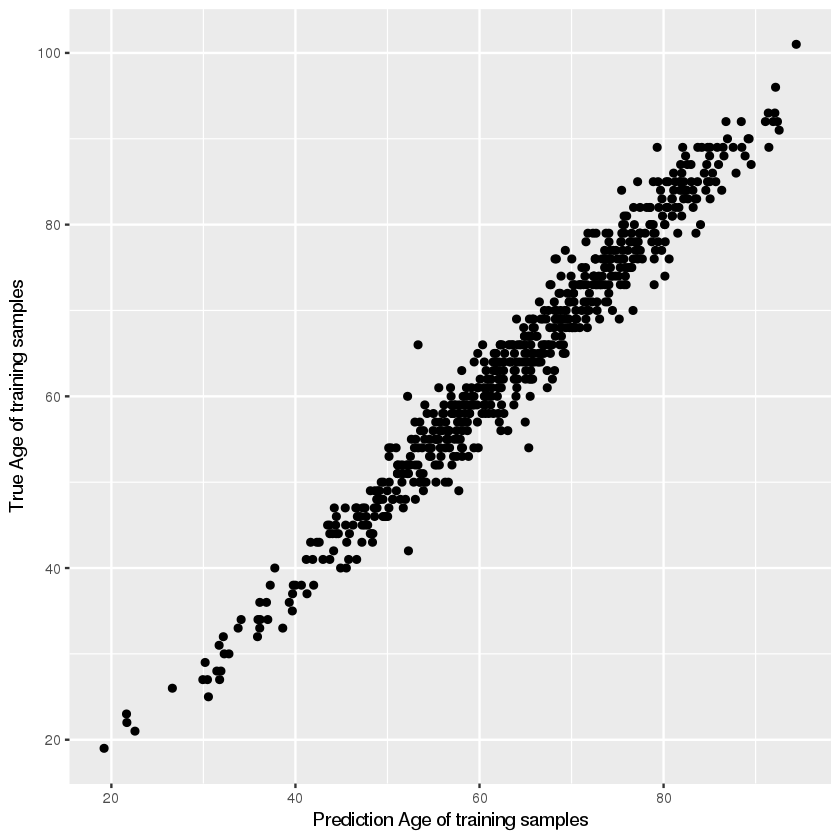
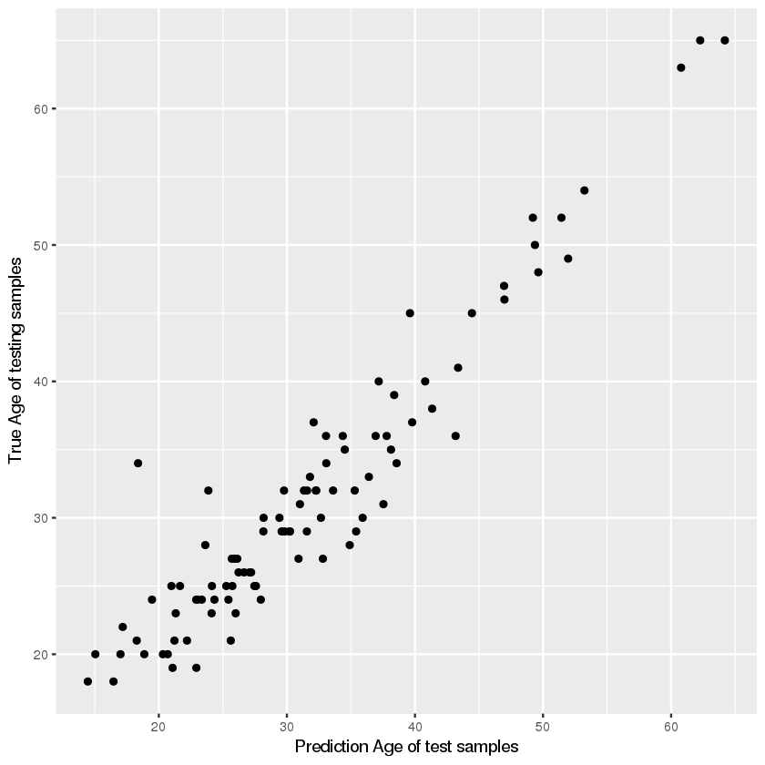

# Background Questions:
1.) What are/is the diseases of interest ascertained in Horvath’s study? Draw the E, G, P, and D associative diagram (from Lecture 1 and 2) and annotate what is investigated in Horvath’s study  


__ANS:__ 
In Horvath's study, he investigate the whether DNA methylation, an epigenetic modification, can predict age 

2.) What is the biological role of “DNA methylation”? How and where is DNA methylated? 
__ANS:__ DNA methylation is a process by which methyl groups are added to the DNA molecule. Methylation can change the activity of a DNA segment without changing the sequence. When located in a gene promoter, DNA methylation typically acts to repress gene transcription.  

In mammals, DNA methylation is almost exclusively found in CpG dinucleotides, with the cytosines on both strands being usually methylated. The exception is CpG islands, a certain stretches (approximately 1 kilobase in length) where high CpG contents are found.  

<Ref: https://en.wikipedia.org/wiki/DNA_methylation>  

3.) What is the assay platform for this study? Briefly describe the concept behind the assay technology 
__ANS:__
Illumina 450 and 27k chips. It is a microarray that quantifies methylation levels at specific loci within the genome. Probes on the 27k array target regions of the human genome to measure methylation levels at 27,578 CpG dinucleotides in 14,495 genes.The 450K array targets >450,000 methylation sites.


4.) What statistical method did Horvath use? What R package encodes this method? Download and install this package onto your R installation. Write down the function call (assume the dependent variable, or variable to be predicted is called age and the methylation indicators are in a variable called x

__ANS:__ ElasticNet Regression is used in the paper. In R, ElasticNet Regression can be done by "glmnet" package

```{r eval = FALSE}
library(glmnet)
# Assume x and age is training data
glmnet.Training.CV <- cv.glmnet(x, age, nfolds=10,alpha=alpha,family="gaussian")

lambda.glmnet.Training <- glmnet.Training.CV$lambda.min
# Test set test_x
test_age <- predict(glmnet.Training.CV, s=lambda.glmnet.Training, newx= test_x)

```

5.) Both GWAS and predictive methods can be used for variable selection. Aside from the question and data modalities, what are the key analytic differences between GWAS, EWAS, and the method applied in Horvath’s paper? (2 points)
__ANS:__
In GWAS and EWAS, we are performing tens of thousands of statistical testing through all the variables(In GWAS these are SNPs, while EWAS these are exposome). The variable selection is based on the results of each tests, whether it's chi-sqaure test or regression. 

In this paper, we use ElasticNet, it is actually performing only one test, examining all the variables together. Though we may do it many times to find the best lambda, but they are basically the same set of training data, with different parameters. The variable selection is selected as this model find the best fit output.


6.) What is the biological relevance of “age acceleration” or “age deceleration”? How is this quantity estimated? 
__ANS:__
The age predicted by the methylation sites would be the biological age, and the true age would be the chronological age. When biological age is greater than chronological age, it's called age acceleration. While the age deceleration is the opposite when biological age is lesser than chronological age. The quantity can be test the validity of various theories of biological aging, diagnosing/predicting various disease, evaluation therapeutic intervention... etc


7.) What is the sample size of the training (GSE40279) and the testing datasets (GSE41169)? 
__ANS:__
Training(GSE40279) : 656 samples, with 473034 methylation sites  
Testing (GSE41169) : 95 samples, wth 485577 methylation sites  


1.) Where is the age information in the data.frames? Write code to get the age from the data.frame in both the training and testing data. Second, how many probes do they have in common? Create a new training and testing dataset that only contains the methylation probes that are in common in both of the datasets. (10 points)
__ANS:__
For training data, age is in gse40279.meta column 'title'
For testing data, age is in gse41169.meta column 'characteristics_ch1.6'

```{r eval = FALSE}
get_age <- function(x){
    rm_between(x, 'age', 'y', extract=TRUE)[[1]]
}

train_age_title <- as.data.frame(gse40279.meta[,1])
train_age <- as.numeric(apply(train_age_title,1,function(x) rm_between(x, 'age','y', extract= TRUE)[[1]]))

test_age_title <- (gse41169.meta[,16])
test_age <- as.numeric(gsub("\\D","",test_age_title))
```

__ANS:__
For training data and testing data, there are 118271 methylation probes in common

```{r eval = F}
train_probe <- rownames(gse40279.data)
test_probe <- rownames(gse41169.data)
common_probe <- intersect(train_probe, test_probe)

train_data <- as.data.frame(gse40279.data) %>% rownames_to_column('probe') %>% filter(probe %in% common_probe) %>% column_to_rownames(var = 'probe')
test_data <- as.data.frame(gse41169.data) %>% rownames_to_column('probe') %>% filter(probe %in% common_probe) %>% column_to_rownames(var = 'probe')
```

2.) What are the quartiles (25th percentile, 50th percentile, and 75th percentile, maximum, and minimum) of the distribution of age in each of the datasets? What is the mean and standard deviation? What is the sample size of the datasets?
__ANS:__
_Training data :_  
Min.    25%.     50%      75%.     Max.    
19.00   54.00    65.00    75.00   101.00   

Mean:  64.04
Standard deviation: 14.74

_Test data:_  
Min.    25%.     50%      75%.    Max. 
18.00   24.50    29.00    36.00   65.00   

Mean: 31.57
Standard deviation: 10.28  

3.) The testing and/or training datasets may have missing values (e.g., NA). To avoid “throwing data away”, we will impute missing data with the mean. Write code to find the mean value of each probe in the dataset and impute the missing value for a probe by the probe mean. For example, if patient 10 had a missing value for probe cg1234, then replace the NA for patient 10 at cg1234 with the mean of cg1234 from the non-missing values of the population.

```{r eval = F}
impute_mean <- function(x){
    mean <- mean(x, na.rm = T)
    x[which(is.na(x))] <- mean
    x
}

train_data_imputed <- t(apply(train_data,1, impute_mean))
test_data_imputed <- t(apply(test_data,1, impute_mean))
```

4.) Predict age in the training dataset by optimizing the lambda parameter by 10-fold cross validation using only the probes that are in common in both the training and testing datasets using ElasticNet regression (alpha parameter is 0.5). What is the lambda? Output the final model coefficients in a csv file (without headers) where the first column is the DNA methylation ID and the second column is the coefficient.
```{r eval = FALSE}
alpha = 0.5
glmnet.Training.CV = cv.glmnet(t(train_data_imputed), train_age, nfolds=10,alpha=alpha,family="gaussian")
lambda.glmnet.Training = glmnet.Training.CV$lambda.1se
coef <- coef(glmnet.Training.CV, s = lambda.glmnet.Training)

# Output csv file
out_df <- data.frame(probe = probe, coef = as.numeric(coef))
write.table(out_df, "coefficeient.csv", col.names = F, row.names = F, sep = ',')
```
__ANS:__ 
Using 10-fold cross validation, the lambda that generate the best model is 0.6719(lambda.min), 
the best model with lesser variable selected, but within 1 stardard error is 1.230(lambda.lse).
In case of overfitting, we'll use lambda.1se for prediction.


5.) What is the R2 and correlation of predicted versus actual age of the model in the testing and training datasets
```{r eval = F}
# Prediction on training data
pred_train <- predict(glmnet.Training.CV, s=lambda.glmnet.Training, newx = t(train_data_imputed))
# Prediction on test data
pred <- predict(glmnet.Training.CV, s=lambda.glmnet.Training, newx=t(test_data_imputed))


# Train data R-square 
mean_train_age <- mean(train_age)
SS_total <- sum((train_age - mean_train_age)^2)
SS_res <- sum((train_age - pred_train)^2)
train_r_square <- 1 - (SS_res/SS_total)

# Train data correlation 
train_cor <- cor(train_age, pred_train)

# Test data R-square 
mean_test_age <- mean(test_age)
SS_total <- sum((test_age - mean_test_age)^2)
SS_res <- sum((test_age - pred)^2)
test_r_square <- 1 - (SS_res/SS_total)
test_r_square

# Test data correlation
cor(test_age, pred)
```

__ANS:__
Training data : R-square: 0.921 , correlation: 0.964
Test data: R-square: 0.890, correlation: 0.949

6.) Plot the predicted versus actual age of both the training and testing data.
```{r eval = FALSE}
qplot(pred_train, train_age, xlab = "Prediction Age of training samples", ylab = "True Age of training samples")
```


```{r eval = FALSE}
qplot(pred, test_age, xlab = "Prediction Age of test samples", ylab = "True Age of testing samples")
```


7.) In the testing data set, how many individuals are “Age accelerated”? “Decelerated”? 
```{r eval = F}
test_accelarate <- pred - test_age
table(test_accelarate>0)
```
__ANS:__
In test data, out of 95 samples, 63 samples are age accelerated and 32 samples are age decelerated


# BONUS
1.) How can one analytically test if age acceleration is statistically different in males versus females? Execute this test in the training and testing datasets. 
__ANS:__
It can be tested by a 2 by 2 contigency table, and use chi-square test to check is there are acceleration.
```{r eval = F}
# Test set
test_sex <- (gse41169.meta[,'characteristics_ch1'])
test_sex <- ifelse(test_sex == 'gender: Male', 'M', 'F')
table(test_sex, test_accelarate>0)
chisq.test(table(sex, test_accelarate > 0))

# Training set
train_sex <- gse40279.meta[,'characteristics_ch1.3']
train_sex <- ifelse(train_sex == "gender: M", 'M', 'F')
table(train_sex, train_accelarate > 0 )
chisq.test(table(train_sex, train_accelarate > 0 ))
```
In test data, p-value is 0.6574. In training data, p-value is 0.1313. Both of them are not significant, suggesting that age acceleration is not significantly different in male and female.


2.) Rank the coefficients in order from largest in absolute value to smallest. What genes are implicated by the methylated sites picked by your model? Hint: attaining the 450K annotation file from an additional R library (IlluminaHumanMethylation450k.db) may be useful for answering this question.   

```{r eval = FALSE}
source("https://bioconductor.org/biocLite.R")
biocLite('FDb.InfiniumMethylation.hg19')
```

```{r eval = FALSE}
library(FDb.InfiniumMethylation.hg19)
hm450 <- get450k()
coef <- read.csv("coefficeient.csv", header = F, sep = ',')
selected_probes <- coef[which(coef[,2] != 0), ]
rank_probes <- selected_probes[order(abs(selected_probes[,2]), decreasing = T),1]
# Remove Intercept
rank_probes <- rank_probes[-3]
genes <- getNearestGene(hm450[rank_probes])
genes <- unique(genes$nearestGeneSymbol)
genes
```
__ANS:__ Some top genes include FHL2, SFMBT1, IP6K1, SYT6, PPP1R21, POU4F2, LOC148696, AMER3, GFI1, .... etc  

3.) Execute “principal components analysis” on the training dataset with the probes that were selected by ElasticNet regression. First, compute the correlation matrix between the selected probes and input the correlation matrix into the builtin principal components method in R, called prcomp. How many principal components describe 90% of variation in the dataset? What does this imply?  
```{r eval = F}
selected_train_data <- train_data_imputed[rank_probes,]
cor_matrix <- cor(t(selected_train_data))
pca <- prcomp(cor_matrix)

eigenvals <- pca$sdev^2
var_explained <- cumsum(eigenvals) / sum(eigenvals)
var_explained[2]
min(which(var_explained >= 0.9))
```
__ANS:__ First 6 principal component could explain 90% of the variables.  

4.) Use hierarchical clustering to cluster the probes that were selected by ElasticNet regression. Choose the top 3 probes that glmnet found by absolute value of coefficient size. What other probes are “clustered with” these probes? Describe some of the genes that are in this cluster. Do they make biological sense?  
```{r eval = F}
dist <- dist((selected_train_data))
cluster <- hclust(dist)
c <- cutree(cluster, 50)

for(i in 1:3){
  cluster_probe <- names(wich(c == i))
  cluster_gene <- getNearestGene(hm450[cluster_probe])
  write.csv(cluster_gene,paste("cluster",i,".csv"))

}
```
__ANS:__  
To find the cluster genes, first we find the top 3 probes with high absolute value of coefficient, which are cg06639320 cg03607117 cg13033938. Then we use hierachial clustering to find the cluster to these 3 probes, and annotate with gene names.  

Then we use DAVID to do the gene set enrichment analysis, the results are:  

1. Cluster1: cg06639320  
Genes : FHL2, GPR62 CLASP1  
These genes are enrich in cellular component related with focal adhesion.  

2. Cluster2: cg03607117  
Genes: SFMBT1, ESPN, SLC6A6, PROK2, BOK, MECOM, ZDBF2, 4-Mar, GFI1, HES2, SYF2, CERKL, OSR1, LIMD1, GFI1, COMMD1  
This cluster are enrich in DNA transcription regulation and components of zinc finger.    

3. Cluster3: cg13033938  
Genes: IP6K1, PPP1R21, GFI1, ARHGEF33,TXNDC12, ZNF518B, GFI1, ALX3  
This cluster also enrich in DNA transcription regulation nucleus component.  

The biological function of genes related to important methylation probes seems largely related to some core cell function like DNA transcription or DNA binding(zinc finger). Reduction in the funtion could possibly explain the degeneration of biological age.
