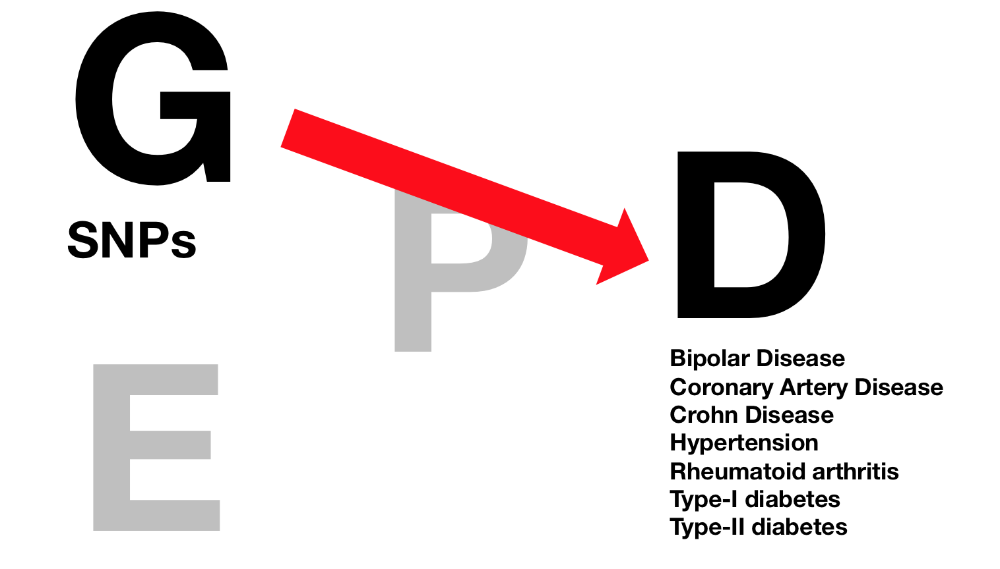
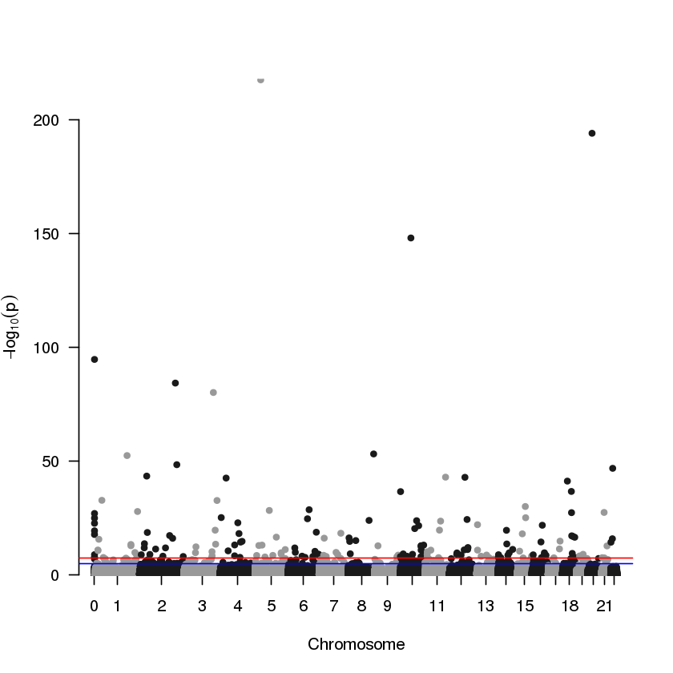
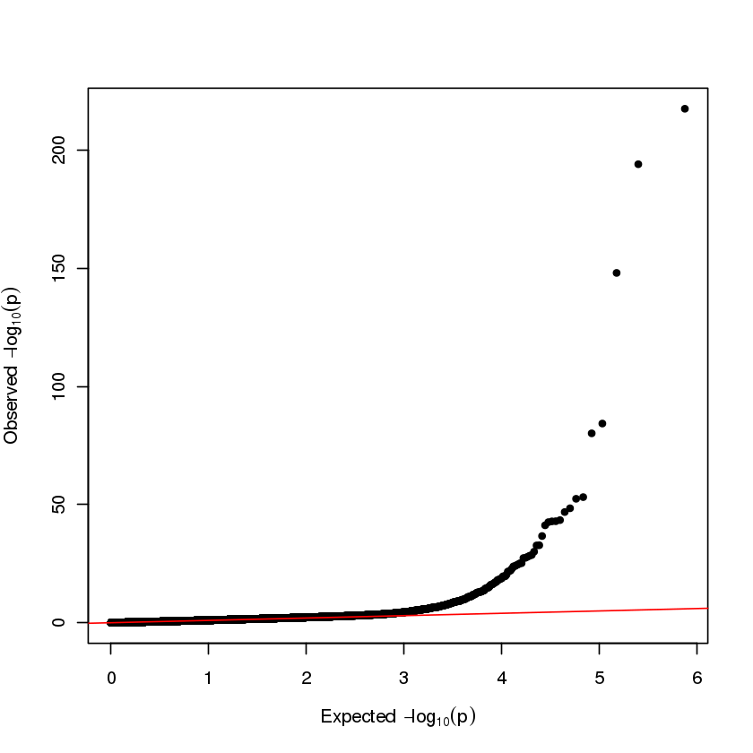
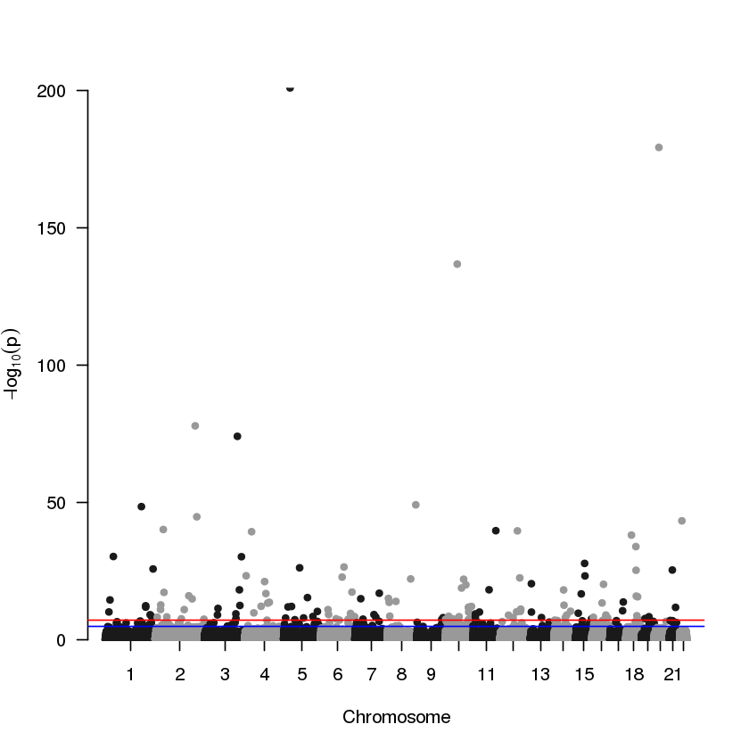
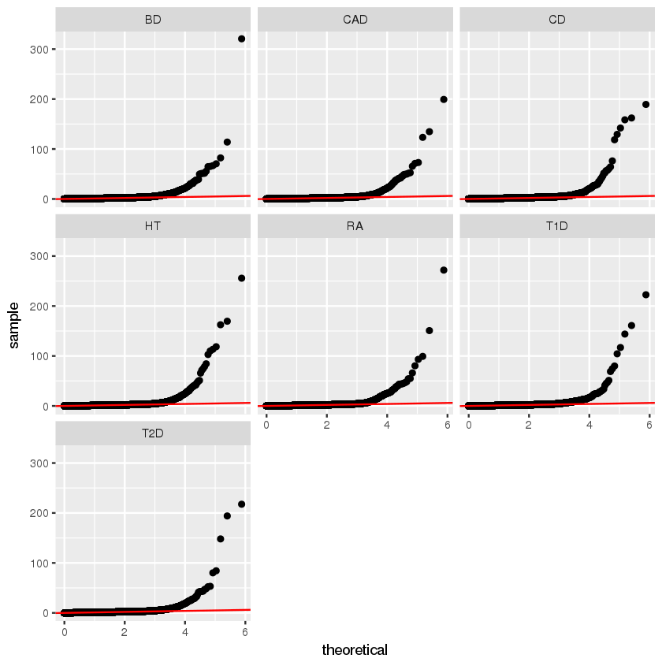
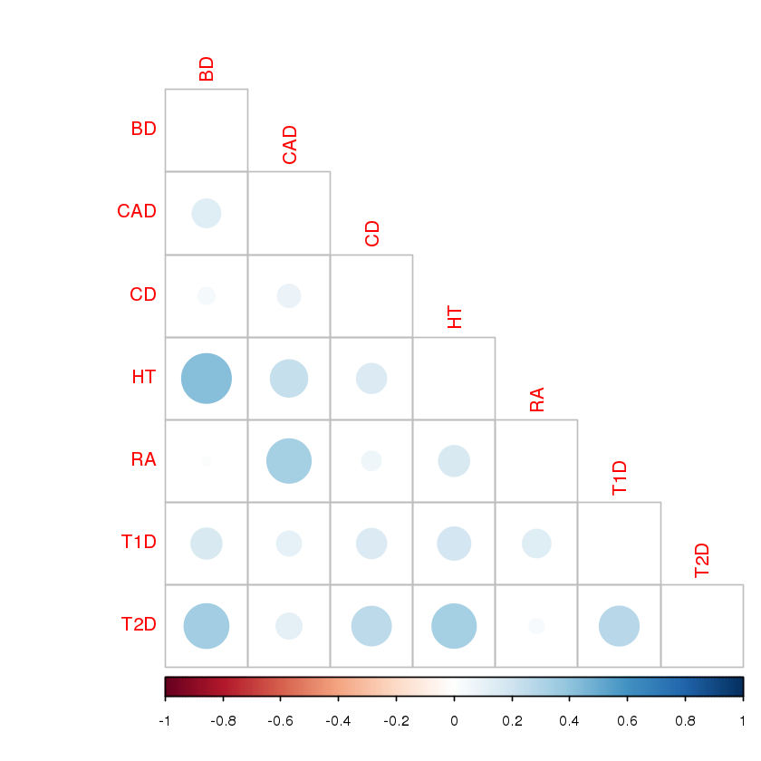

# Background questions:
1.) What are the diseases of interest ascertained in the WTCCC study? Draw the E, G, P, and D diagram and annotate what is investigated in the WTCCC GWASs.  


2.) How are the each of the seven diseases assayed phenotypically  

__- Bipoloar Disease:__   
BD was defined as a lifetime diagnosis of a bipolar mood disorder according to Research Diagnostic Criteria119 and included the bipolar subtypes that have been shown in family studies to co-aggregate.  

__- Coronary Artery Disease:__  
CAD cases had a validated history of either myocardial infarction or coronary revascularization (coronary artery bypass surgery or percutaneous coronary angioplasty) before their 66th birthday.   

__- Crohn Disease:__   
CD cases were attendees at inflammatory bowel disease clinics in and around the five centres which contributed samples to the WTCCC (Cambridge, Oxford, London, Newcastle, Edinburgh). Ascertainment was based on a confirmed diagnosis of Crohn’s disease (CD) using conventional endoscopic, radiological and histopathological criteria.  

__- Hypertension: __    
History of hypertension diagnosed before 60 yr of age, with confirmed blood pressure recordings corresponding to seated levels >150/100 mmHg (if based on one reading), or the mean of 3 readings greater than 145/95mmHg.  

__- Rheumatoid arthritis: __  
Caucasian over the age of 18 yr and satisfied the 1987 American College of Rheumatology Criteria for RA127 modified for genetic studies    

__- Type-I Diabetes: __   
Age of diagnosis below 17yr and insulin dependence since diagnosis (with a minimum period of at least 6 months)  

__- Type-II Diabetes: __    
Selected from UK Caucasian subjects who form part of the Diabetes UK Warren 2 repository. The diagnosis of diabetes was based on either current prescribed treatment with sulphonylureas, biguanides, other oral agents and/or insulin or, in the case of individuals treated with diet alone, historical or contemporary laboratory evidence of hyperglycaemia (as defined by the World Health Organization). Other autoimmune diabetes are excluded.  

3.) What is the assay platform for this study? Briefly describe the concept behind the assay technology.  
__ANS:__  
All 17,000 samples were genotyped with the __GeneChip 500K Mapping Array Set (Affymetrix chip)__, which comprises 500,568 SNPs.  

The assay platfrom is a kind of SNP array. Major components of SNP array include:
- An array containing immobilized allele-specific oligonucleotide (ASO) probes.  
- Fragmented nucleic acid sequences of target, labelled with fluorescent dyes.  
- A detection system that records and interprets the hybridization signal.  

Using the technique largely facilitate the early GWAS studies.


4.)How many SNPs are measured for each individual for all the chromosomes
 490032 for Chromosome 1-22  
 500568 for Chromosome 1-22 + X chromosome  


5.) Let’s start small. The year is 1999, and an investigator has painstakingly genotyped 1 SNP called (rsGOINGALLIN) in individuals with bipolar disorder and without. rsGOINGALLIN can take on the 3 genotype configurations, CC, CT, TT. He has collected the following data:

                     | CC     | CT    | TT
      _______________|________|_______|______
      Bipolar        | 270    | 957   | 771
      Health Controls| 436    | 1398  | 1170

He asks you how to execute an allele-based test of association “allele frequency test”, whereby thereference allele is the major allele (the allele, C or T, that is most prevalent in the healthy population).

A.) What is the allele frequency (C and T) in bipolar population? And in Controls? 
```{r}
bipolar <- c(270,957,771)
control <- c(436,1398,1170)
tab <- matrix(c(bipolar, control), 2, byrow = T)
colnames(tab) <- c("CC","CT","TT")

C_bipolar <- bipolar[1]*2 + bipolar[2]
T_bipolar <- bipolar[3]*2 + bipolar[2]
C_bipolar_freq <- C_bipolar/(2*sum(bipolar))
T_bipolar_freq <- T_bipolar/(2*sum(bipolar))
  
C_control <- control[1]*2 + control[2]
T_control <- control[3]*2 + control[2]
C_control_freq <- C_control/(2*sum(control))
T_control_freq <- T_control/(2*sum(control))
```
__Bipolar__: C: 0.375 T:0.625  
__Control__: C: 0.378 T:0.622  

B.) Execute a chi-squared test to test the association of the allele frequency in bipolar vs. controls in R and report the pvalue. Is there evidence to conclude there is an association between rsGOINGALLIN and bipolar disorder?   
```{r}
tab2 <- matrix(c(C_bipolar,T_bipolar,C_control,T_control),2,byrow = T)
chisq.test(tab2,correct = F)
```
__ANS:__ There is no evidence to conclude the association between the SNPs and bipolar disorder, because the p-value is 0.7459, which is much larer than 0.05  

C.) Execute a chi-squared test amongst healthy controls to test for deviation from Hardy-Weinberg equilibrium.  
```{r}
p <- 0.378
q <- 1-p
obs <- control
exp <- c(p*p, 2*p*q, q*q) * sum(obs)
chi <- sum((obs - exp)^2/exp)
p <- pchisq(chi, df = 1, lower.tail = FALSE)
p

```
__ANS:__ p-value is 0.57, which is not deviated from HWE.

# Execution of GWAS:
A.) After filtration, how many SNPs are available for analysis? Why filter out SNPs that deviate from Hardy-Weinberg? What is the Bonferroni-threshold of significance (round to 1 significant figure)  
__ANS:__
- After filtration, there are __376868__ SNPs available for analysis.   

- When the ratios of genotypes significantly deviate from the HWE, it can indicate genotyping erros, batch effects or population stratification. In these situation, the SNP should be removed so it won't affect our study for association.  

- Bonferroni-threshold: 0.05/376868 = $1.326*10^{-7}$  


B.) Compile the GWAS results into one .csv table and call it ‘T2D.csv’  

2.) Analysis of GWAS results:  
A.) Produce a manhattan plot and qqplot of the pvalues .  
```{r eval = FALSE}
man <- data %>% select(SNP = rsID, CHR = Chromosome, P = chi2_pvalue)
man$BP <- as.numeric(rsID$end)
man$CHR <- as.numeric(man$CHR)
man <- man[which(!is.na(man$BP)),]
manhattan(man)
```

```{r eval = FALSE}
qq(data$chi2_pvalue)
```


B.) How many SNPs were found that exceeded the Bonferroni-level of significance for T2D?  
__ANS:__ 162  
C.) What could be biasing the associations and how might one control for this phenomenon?  
__ANS:__ The population composition in controls and cases could possibly contribute to bias.   Such bias can possibly be avoided by population stratification.   

D.) What is the p-value of association and odds ratio for rs4506565 for T2D? What is the
interpretation of the odds ratio? What gene is this SNP associated with and its putative function in T2D pathogenesis?  
__ANS:__   
- rs4506565 p-value: $1.450267*10^{-13}$  
- rs4506565 odds ratio:   
  - 0.7301045 (Major v.s Minor)  
  - 1.369667  (Minor v.s Major)  
- The SNPs is associate with TCF7L2 gene. Study had shown that silencing of TCF7L2 exerts a strong inhibitory effect on glucose-induced insulin secretion, which is important in the type II diabetes pathogenesis. (Diabetes. 2009 Apr; 58(4): 800–802.)  


3.) You just executed an allele frequency test of association. How would an additive test of association and genotypic test of association be different? Write down how you would conceptually test each in the WTCCC datasets using a chi-squared or logistic regression model
__ANS:__ Additive test and genotypic test will have different assumption than allele frequency test, and can be tested using logistic regression model.  

For additive test, the variables will be the number of minor allele. For example, for a SNP with reference allele C and minor allele T, the variable will be the number of T in an genotype, that is CC = 0, CT = 1, TT = 2. The fit into a logistic regression model.  
```{r eval = FALSE}
data$C_count <- ifelse(data$genotype=='TT', 2, ifelse(data$genotype == 'CT', 1, 0))
mod <- glm(disease ~ C_count, family = binomial(), data)
summary(mod)
```

For genotypic test, the variables will be each different genotypes. For example, for a SNP with genotype CC, CT, TT, all three of the genotypes will treat independetly, and be fit into a logistic regression model.  
```{r eval = FALSE}
mod <- glm(disease ~ factor(genotype, levels=c('CC','CT', 'CT')), family=binomial(), data)
summary(mod)
```


4.) What is the main analytical differences between the test in Background Question 4 (candidate SNP) and GWAS? Why would one want to execute one or the other   
__ANS:__ For only one SNP, we can perform the statistic test directly and obtain the p-value. However, in GWAS, we perform more than 30 thousands tests, and will be problem of mutliple testing. Under null hypothesis, p-value distribution will be uniform, so some SNPs(about 5%) will show significant merely by chance even there are no assiciation. Therefore in GWAS, we need to do mutiple testing correction to control the false discovery rate.  


5.) In question 2B.), you identified sources of biases for GWASs. One source of bias can be controlled for using information from the SNP array. What is this factor?  
__ANS:__
One source of bias can result from ancestry because of popluation startification. The influence of can be adjusted by calculating genomic inflation factor.  


6.) The genomic inflation factor is arithmetically defined as the median of the observed chi-squared values (a function of the pvalues in GWAS) divided by the median of the expected chi-squared values.  

Estimate the genomic inflation factor for your GWAS in T2D. What does this quantity estimate?  

__ANS:__
Genomic inflation factor can be calculated as median of observed chi-squared statistics divided by the expected median chi-square statistics. Which in my analysis.r file, genomic inflation factor of T2D is calculated as:    
```{r eval = FALSE}
If <- qchisq(median(data$chi2_pvalue),1,lower.tail = F)/qchisq(0.5,1)
```

or by R package "GenABEL"  

```{r eval = FALSE}
library(GenABEL)
If <- estlambda(data$chi2_pvalue, method="median")$estimate
```

Inflation factor : 1.08323789374149.   
This quantity estimate the effect of popluation stratification. If inflation factor is close to one, the data has no stratification. If it's greater than one, than data needed to be adjusted. Generally an inflation factor less than 1.1 is acceptable.  


7.) BONUS. Modify your code to take into account this bias and re-run your associations for ‘Executing GWAS’  
__ANS:__   
The pvalue can be adjusted by dividing chi-square statistics with inflation factor.  

```{r eval = FALSE}
IFadusted.pvalue <- pchisq(qchisq(data$chi2_pvalue, 1, lower.tail = F)/If, df = 1, lower.tail = F)
man$P <- IFadusted.pvalue
manhattan(man)
```


The above is the manhattan plot after adjusting inflation factor. The results did not differ significantly with original plot. Number of significant SNPs with bonferroni correction is __144__.

Genetic architecture and disease similarity (BONUS):  
Execute question 2 for all 7 diseases and answer the following questions.  
1.) Produce a qqplot for each disease using ggplot. Rank each disease by the number of significant findings (pvalue threshold of 1x10-7)   
```{r eval = FALSE}
qnlog10 <- function(p) {
        -log10(qunif(p[length(p):1]))
}
ggplot(all_data, aes(sample = -log10(chi2_pvalue))) + stat_qq(distribution = qnlog10) + geom_abline(col = 'red') + facet_wrap(~ disease)
```

Number of Significant genes using threshold = $10^{-7}$

disease	| SNPs_count | Rank
________| __________ | ______
BD	    |   239      |   1
HT	    |   189      |   2
T1D	    |   187      |   3
RA	    |   171      |   4
CD	    |   165      |   5
CAD	    |   164      |   6
T2D	    |   159      |   7


2.) What disease, if any, diseases are associated with the the SNP rs6679677?  
```{r eval = FALSE}
all_data %>% filter(rsID == "rs6679677") %>%  filter(chi2_pvalue <= 1e-7)
```
__ANS:__ Type I diabetes and rheumatic arthritis are associated with SNP rs6679677  

SNP       Odds ratio    p-value     disease           
__________________________________________
rs6679677	0.5186958  	7.803590e-28	  RA
rs6679677	0.5245492 	7.685367e-27		T1D

3.) What are the potential biological meaning of a SNPs found in multiple diseases?  
__ANS:__  
SNPs found in multiple disease probably involve in some upstream biological prcoess, or some common inflmmatory resonse. An alter of the SNPs could probably contribute to different pheotypes by different tissues or organs. For example, rs6679677 is associated with some inflammatory process, which can cause different autoimmune disease like type I diabetes and rheumatic arthritis.   

4.) Devise a method to correlate diseases on the basis of their association statistics (e.g., pvalues and/or odds ratios). What diseases are most correlated with each other?   

__ANS:__ To see the correlation of diseases, I only looked at the top differential SNPs. The assumption is if two diseases are highly correlated, the differential SNPs in A diseases will also be differentiate in B disease. And for the rest of the SNPs that are not being selected, I assume they are just common variants in normal population, which will give less value to see the correlation between diseases.  

The method is to take __top 200__ differentiated SNPs in each disease, so 200*7 = 1400 SNPs are selected. Then, we remove the replicate SNPs, this give us __753__ candidate SNPs for analysis. Then calculate the correlation of p-value.The correlation test is calculate with non-parametric spearman method, since some extreme value in p-value may affect the results.  
```{r eval = F}
rsID_list <- data.frame(rsID = c(), chi2_pvalue= c())
for(d in disease){
    print(d)
    r <- all_data %>% filter(disease == d) %>% select(rsID, chi2_pvalue) %>% top_n(-100, chi2_pvalue)
    print(head(r))
    rsID_list <- rsID_list %>% bind_rows(r)
}

for(i in 1:7){
    for(j in 1:i)
        if(i != j){
            d1 <- disease[i]
            d2 <- disease[j]
            d1 <- all_data %>% filter(disease == d1) %>% 
                               filter(rsID %in% rsID_list$rsID) %>% 
                                select(chi2_pvalue) 
            d2 <- all_data %>% filter(disease == d2) %>% 
                               filter(rsID %in% rsID_list$rsID) %>%
                               select(chi2_pvalue)
            c <- cor(d1, d2, method = 'spearman')
            cor_table[i,j] <- c
            
        }
}

corrplot(cor_table, method = 'circle', type = 'lower')
```
  
From the correlation table we can see that the top associated diseases is Hypertension and Bioploar disease. Rheumatic arthritis and coronary artery disease shows assoication. Type II diabetes is related to several other diseases, including bipolar disease and hypertension.    

